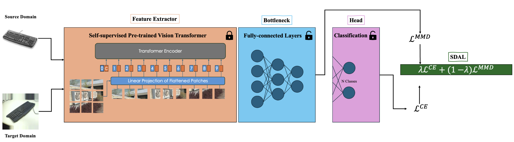

# EUDA: An Efficient Unsupervised Domain Adaptation via Self-Supervised Vision Transformer

[](https://arxiv.org/abs/2407.21311)

## Introduction

EUDA (Efficient Unsupervised Domain Adaptation) is a novel approach leveraging self-supervised Vision Transformers for domain adaptation tasks. This method significantly reduces the number of learnable parameters, making the adaptation process more efficient while maintaining high performance.

The implementation includes a submodule from [DINOv2](https://github.com/facebookresearch/dinov2), which provides the self-supervised pre-training backbone for our Vision Transformer model.

## Key Features

- **Efficient Parameter Usage**: Utilizes 42% to 99.7% fewer learnable parameters.
- **Self-Supervised Learning**: Leverages Vision Transformers pre-trained in a self-supervised manner.
- **Scalable**: Designed to be scalable and adaptable to various domain adaptation scenarios.
- **Flexible Architecture**: Built with modularity and flexibility, allowing easy modifications and extensions.

## Architecture

The architecture consists of a Vision Transformer backbone pre-trained using self-supervised learning techniques provided by DINOv2. This backbone is then adapted using our efficient unsupervised domain adaptation methodology.



## Installation

### Prerequisites

- Python >= 3.8
- Additional dependencies as listed in `requirements.txt`

### Steps

1. **Clone the Repository**

```bash
git clone --recurse-submodules https://github.com/A-Abedi/EUDA
cd EUDA
```

2. **Install Dependencies**

```bash
pip install -r requirements.txt
```

## Usage
### Data Preparation
Download the datasets from [Office-31](https://drive.google.com/file/d/0B4IapRTv9pJ1WGZVd1VDMmhwdlE/view?resourcekey=0-gNMHVtZfRAyO_t2_WrOunA), [Office-Home](https://drive.google.com/file/d/0B81rNlvomiwed0V1YUxQdC1uOTg/view?resourcekey=0-2SNWq0CDAuWOBRRBL7ZZsw), [VisDA-2017](https://github.com/VisionLearningGroup/taskcv-2017-public/tree/master/classification) and place them in a directory of your choice.

Specify the path to this directory using the `--dataset_path` argument in the running command.

### Training
Run training process using this command:
```bash
python3 Main.py --train_batch_size BATCHSIZE --dataset DATASET_NAME --name EXPERIEMENT_NAME --train_list TRAIN_LIST --test_list TEST_LIST --num_classes NUM_CLASSES --backbone_size BACKBONE_SIZE --bottleneck_size BOTTLENECK_SIZE --num_steps NUM_STEPS --img_size IMAGE_SZIE --gpu_id GPU_ID --dataset_path /Datasets/
```

For example:
```bash
python3 Main.py --train_batch_size 32 --dataset office-home --name office_home_da --train_list Data/office-home/Art.txt --test_list Data/office-home/Clipart.txt --num_classes 65 --backbone_size base --bottleneck_size base --num_steps 2000 --img_size 224 --gpu_id 0 --dataset_path /Datasets/
```

### Test
Test the trained model using command like this:
```bash
python3 Main.py --eval_batch_size 64 --test_list Data/office/amazon_list.txt --num_classes 65 --backbone_type DINOv2 --backbone_size base --bottleneck_size base --img_size 224 --gpu_id 0 --is_test --pretrained_dir /Output/checkpoint.bin
```

## Acknowledgements
- [DINOv2](https://github.com/facebookresearch/dinov2)
- Our code is based on the [TVT](https://github.com/uta-smile/TVT) code base. We extend our gratitude to the authors for their contributions.

## References
Include references to the paper:
```plaintext
@article{abedi2024euda,
  title={EUDA: An Efficient Unsupervised Domain Adaptation via Self-Supervised Vision Transformer},
  author={Abedi, Ali and Wu, Q M Jonathan and Zhang, Ning and
                   Pourpanah, Farhad},
  journal={arXiv preprint arXiv:2407.21311},
  year={2024}
}
```